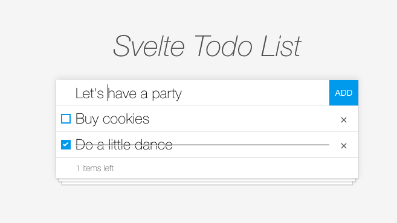

# Svelte Todo List

## Introduction



This app is a simple todo list created with Svelte to try out this framework.

[-- Demo --](https://svelte-todo-list.stevenchoo.now.sh/)

## How to start with Svelte

You can easily start with Svelte using a project template.
For full instructions, visit the Svelte template [GitHub page](https://github.com/sveltejs/template)

This project is created using degit.

```bash
npx degit sveltejs/template svelte-app
cd svelte-app
```

## How to run

Install the dependencies...

```bash
cd svelte-app
npm install
```

...then start [Rollup](https://rollupjs.org):

```bash
npm run dev
```

Navigate to [localhost:5000](http://localhost:5000). You should see your app running. Edit a component file in `src`, save it, and reload the page to see your changes.
